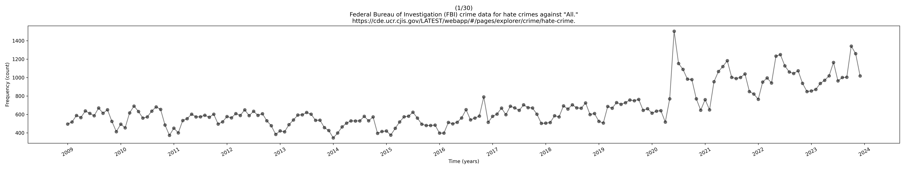

<p align="center">
  
</p>
<h1 align="center">
  Federal Bureau of Investigation (FBI) Hate Crime Data Clustered by
  Groups of People
</h1>

The original data was downloaded on 2024 November 9th as [individual
files](nibrs_files) from the Federal Bureau of Investigation's (FBI) National
Incident-Based Reporting System (NIBRS).

It is publicly available at the following URLs,

- https://www.fbi.gov/how-we-can-help-you/more-fbi-services-and-information/ucr/hate-crime
- https://cde.ucr.cjis.gov/LATEST/webapp/#/pages/explorer/crime/hate-crime

The first link points to the second one and is titled "FBI CRIME DATA
EXPLORER." It appears to be an app that allows you to filter, view and
download the crime-data under different constrains.

# Processing

The original comma separated value (CSV) files from NIBRS were then
aggregated into one file using the following Python script,

- [aggregate.py](aggregate.py)

The aggregated CSV file is given bellow,

- [hate_offenses_fbi_data.csv](hate_offenses_fbi_data.csv)

Other than the standard Python 3, I have used the famous Python
libraries [NumPy](https://numpy.org/) and [Matplotlib](https://matplotlib.org/) for fast numerical
computations and plots.

# Description

Given bellow are the data headers in the aggregated data.

> Date, All, American Indian Or Alaska Native, Arab, Asian, Atheism
> Agnosticism, Bisexual, Black, Buddhist, Catholic, Church Of Jesus
> Christ, Eastern Orthodox Christian, Female, Gay, Gender Non
> Conforming, Hetrosexual, Hindu, Hispanic, Jehovahs Witness, Jewish,
> Lesbian, Male, Mental Disability, Muslim, Native Hawaiian Other
> Pacific Islander, Other Religion, Physical Disability, Protestant,
> Sikh, Transgender, White

The first column lists the dates (YYYY-MM) on which the offenses in
each respective row occurred. The rest of the columns are the _counts_
of the hate offences committed against the corresponding groups of
people on any given date.  E. g., the row corresponding to the date
`2009-01` and column corresponding to the group `Asian` intersect at
the cell with count `13`, i. e., there were 13 hate offences committed
in January of 2009 against Asians in the United States.

Note that all these columns are directly downloaded from NIBRS and not
computed based on other columns. I. e., if a certain row is not
totalling to its corresponding "All" cell then the reason may be
searched for in the documentation available on the FBI websites
provided above.

# Missing Values

The original files from NIBRS were missing data points for certain
dates. These are notated as [not a number](https://en.wikipedia.org/wiki/NaN) _NaN_ values in the
aggregated file.

Even though the aggregate CSV file's date column has dates from
2024-01 to 2024-11. The corresponding rows are all NaNs likely due to
that data not being available at the time of download.

# Code

You can perform your own analysis by reading the data as done in
[read_data.py](read_data.py),

```python
import numpy as np

source = 'https://cde.ucr.cjis.gov/'
source += 'LATEST/webapp/#/pages/explorer/crime/hate-crime'
data = np.loadtxt('hate_offenses_fbi_data.csv', delimiter=',', dtype=object)
header, data = data[0][1:], data[1:]
dates = data[:, 0].astype(np.datetime64)
offenses = data[:, 1:].astype(np.float64)
years = np.array([date.item().year for date in dates[::12]])
```

# Figures

I have generated some basic figures via [explore.py](explore.py) and
[bigplot.py](bigplot.py) that can be found in the [media](media) directory. They
are also drawn bellow,


# License

Scripts or "programs" in this repository plot and aggregate the hate
crimes (per group of people) data from 2009 to 2024 acquired from the
Federal Bureau of Investigation's (FBI) National Incident-Based
Reporting System (NIBRS).

Copyright (C) 2024 Ahmad Tashfeen

This program is free software: you can redistribute it and/or modify
it under the terms of the GNU General Public License as published by
the Free Software Foundation, either version 3 of the License, or (at
your option) any later version.

This program is distributed in the hope that it will be useful, but
WITHOUT ANY WARRANTY; without even the implied warranty of
MERCHANTABILITY or FITNESS FOR A PARTICULAR PURPOSE. See the GNU
General Public License for more details.

You should have received a copy of the [GNU General Public License](COPYING)
along with this program. If not, see <https://www.gnu.org/licenses/>.
